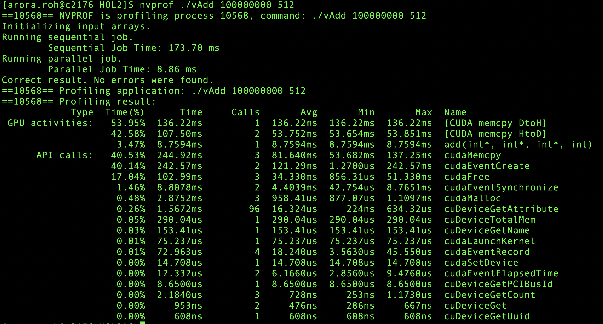
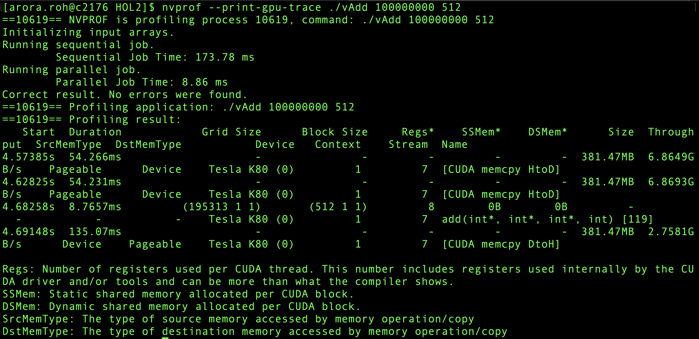

#### sess04L.pdf
* vector addition
* ./vAdd 10000000 2048
  * gives wrong answer.
  * 2048 thread size not allowed. result is garbage
    * use "cudaChecks/wrapper_gpu_error" in code. will catch error early
    * Another way-> cuda-memcheck ./vAdd 1000000 2048. Catches the error
* When you do "nvprof ./vAdd 100000000 512"
  * majority time spent in CUDA memcpy DtoH and CUDA memcpy HtoD.
  * this is small kernel. vector addition is a toy problem. kernel time is way less than data transfer time. cpu code will  be faster here
* profiling commands in "nvprof.bash"
* 
* 
