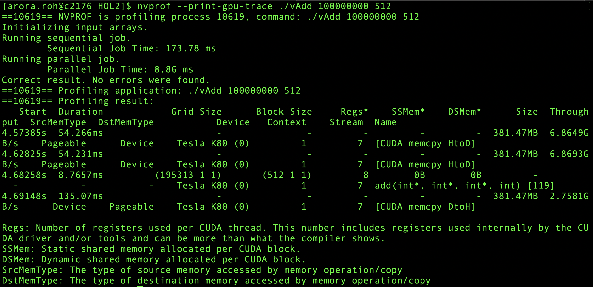

### Vector addition on CUDA

```VectorAdd.cu``` creates random vectors of size arg[1] and adds them based on blockSize arg[2]. CPU vs GPU execution is profiled. Profiling with nvprof further elucidates GPU execution patterns. 

```
Usage 

# compile
nvcc -arch=sm_35 -O3 VectorAdd.cu -o vAdd

#run
./vAdd numElements blockSize
Example
./vAdd 10000000 2048

#using slurm
sbatch slurm_run.sbatch

#cuda memcheck
sbatch memcheck.bash

#profiling
source nvprof.bash
```

#### Pass correct blockSize
* Since kepler has max block 1024, passing anything bigger will give wrong answer
    * Use "cudaChecks/wrapper_gpu_error" to catch error
    * Alternate  ```cuda-memcheck ./vAdd 1000000 2048```

#### Result
```
exec.9929074.out
```

#### Profiling Result

```
Example case
nvprof ./vAdd 100000000 512
```
* Majority time spent in CUDA memcpy DtoH and HtoD.
* This is small kernel and the kernel time is way less than data transfer time. Still overall better than sequential CPU code
* 
* 
