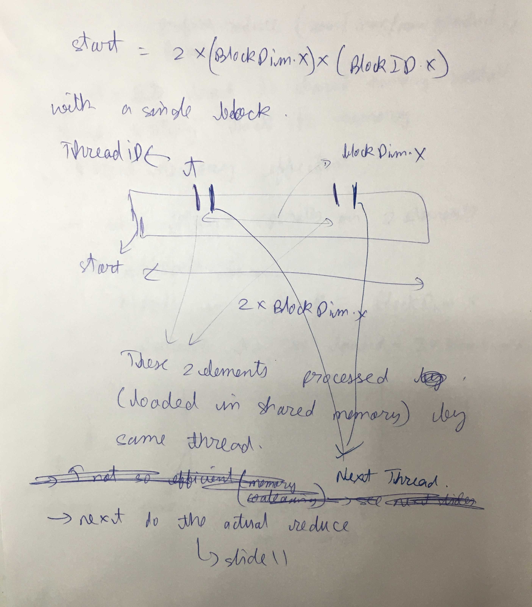
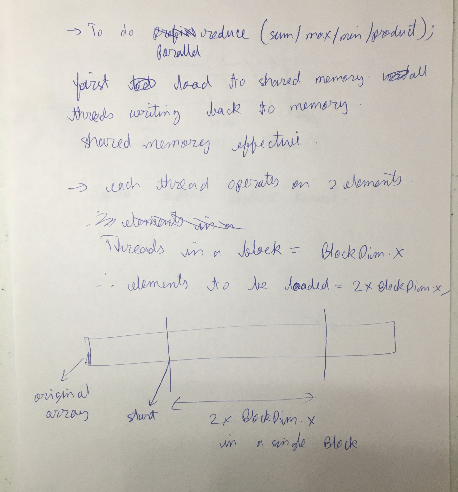
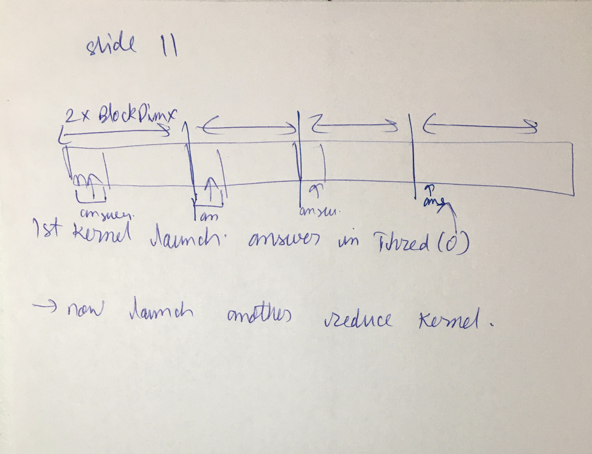
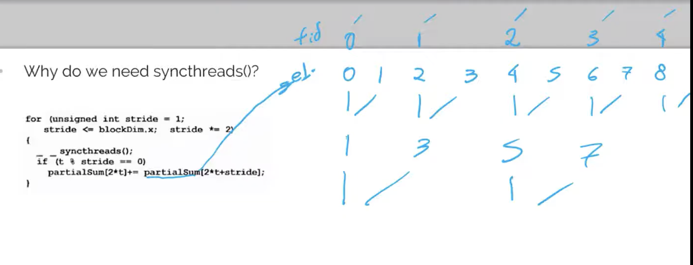

* Parallel Reduction, Prefix Sum, Histogram, Convolution
* Parallel reduce is classic reduction using threads. (Victor Eijkhout HPC Ch 2)
* Prefix sum is same as cumulative sum
* Histogram will have concept of shared memory if parallelized (take care of concurrency)
* Slide 4. Good. "Identity value for reduce operations"
* Slide 5. A parallel reduction tree algorithm performs N-1 operations in log(N) steps
* Slide 6.
  * One drawback. At 1st level- N/2 threads. At 2nd level. N/4 threads. Number of threads used decreases exponentially.
  * workaround on slide 17
* Slide 7. Reduction tree. Total operations are still N-1. But steps are now log(n) (vs N-1). At cost of hardware
  * "work-efficient parallel algorithm"
  * No free lunch
* Slide 9. Replicate the output location
  * Use shared memory in parallel reduction. (Don't write to global memory)

* Slide 10
  * 2*number of threads. blockDim.x is number of threads
  * partialSum is the shared array
* Slide 11. Seen at start of HPC course/textbook. More on slide 12
  * 
  * above t is the local threadID,i.e, t=threadID.x
  * syncthreads needed because first complete all level 1 operations, then level 2 etc
* Slide 13. It may access same banks of shared memory
* Slide 14. All the threads in the wrap need 2 operands. Load1 and Load2. First all threads do load1. Then all threads do load2. Load1 can be coalesced properly only if there is sequential access of load1. Same for load2. Hence slide15 better approach.
  * If more than 16 threads, load1 for some threads will have bank collision.
* Slide 15. Better approach
* Slide 16-22. Ignore.
  * Slide 21. That code wont work on Volta and above
* Prefix sum
  * Hillis Steele Scan.
    * Not work efficient
  * Blelloch Scan
    * Work efficient
* Histogram
  * naive method with atomic add
  * per thread histogram and then reduce
* Convolution
  * Slide 44. gindex is global index. lindex is local index
