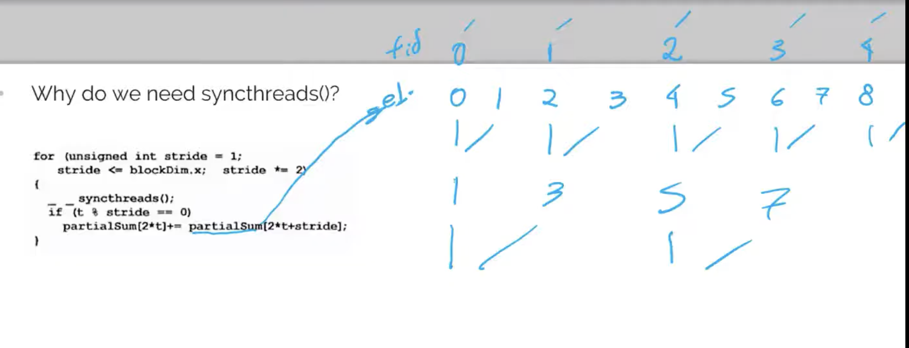

Parallel Reduction, Prefix Sum, Histogram, Convolution
* Slide 4. Good
* Slide 6.
* Slide 7. Reduction tree. Total operations are still N-1. But steps are now log(n) (vs N-1). How so? At cost of hardware
  * "work-efficient parallel algorithm"
* One drawback. At 1st level- N/2 threads. At 2nd level. N/4 threads. Number of threads used decreases exponentially.
  * Some workaround will come soon
* Slide 9. Replicate the output location
  * Use shared memory in parallel reduction. (Don't write to global memory)
* Slide 10
  * 2*number of threads. blockDim.x is number of threads
  * partialSum is the shared array
* Slide 11. Seen at start of HPC course/textbook. More on slide 12
  * 
  * above t is the local threadID,i.e, t=threadID.x
  * syncthreads needed because first complete all level 1 operations, then level 2 etc
* Slide 13. It may access same banks of shared memory
* Slide 15. Better approach

* Questions
  * Slide 10 not clear
