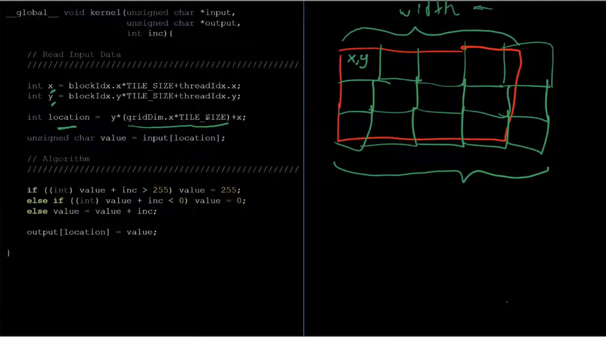

* Slide 28
  * To change brightness, increase/decrease value of every pixel
  * Embarrassingly parallel problem. Use GPUs
* Slide 29. Makefiles
* 
* Slide 33. Good Points
* Slide 34. Sobel Filter. Convolve the filter with image
  * Y is detecting horizontal edges
  * X is detecting vertical edges
