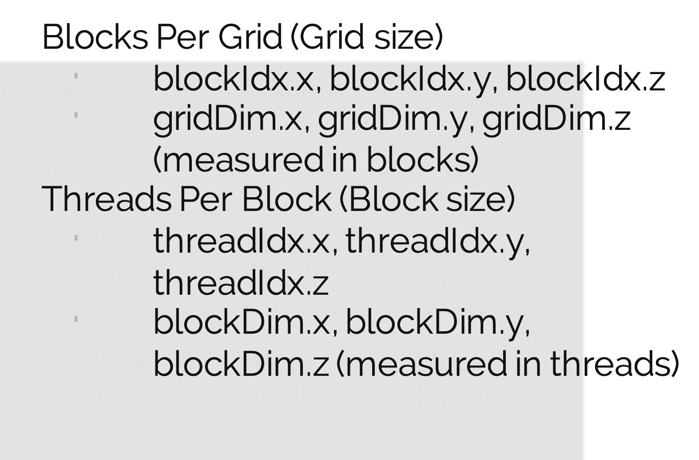

* **Hardware and software abstractions**
* CUDA uses Single Instruction Multiple Thread (SIMT) model
* slide 6
  * CUDA Driver API. Low level, more control
  * CUDA Runtime API. Higher level; implemented on top of the driver API. This repo uses CUDA runtime.
* slide 8- about cuda kernel
  * kernel is the operation that is actual code inside the nested loops
* Slide 10. Flow of a CUDA program
* slide 11- first use cudaMalloc. Allocate memory on GPU
  * cudaMemcpy has **const** void* src pointer. don't want to modify src data
* slide 13.
  * Grid has blocks. Blocks have threads. Threads run the kernel code
  * Slide 13 shows 2D blocks
  * We see here 6 blocks each with 15 threads. Total 90 threads
  * Slide 13. GridDim.X=3, GridDim.Y=2. blockDim.x=5, blockDim.y=3. If blockDim.z not defined, but its implicitly assigned as 1. 15 threads in the block. In general, number of threads in a block= (blockDim.x)\*(blockDim.y)\*(blockDim.z).
  * CUDA core is much simpler than a CPU core. Hence can have thousands of CUDA cores on a GPU chip
  * Thread is a software abstraction for CUDA core. Threads "map" on to CUDA core. But can have more threads than CUDA cores for a SM, with extra threads in waiting state
* Slide 14.
  * A Kernel call creates a Grid.
    * There is only 1 grid present
  * All the blocks in the same grid contain the same number of threads.
  * Blocks Dim can be 1D, 2D or 3D.
  * Thread "ID" can be 1D, 2D or 3D
  * BlockDim is a global number. Constant for the kernel. Thread "ID" is indexing the thread inside that BlockDim
  * Similarly->
  * Grid Dim can be 1D, 2D or 3D
  * Block "ID" can be 1D, 2D or 3D
  * GridDim is a global number. Constant for the kernel. Block "ID" is indexing the block inside that GridDim
    * 3rd dimension of Grid has some small limit
  * 
* Slide 15.
  * How do we define the number of blocks per grid, and threads per block?
    * Consider the nature of the problem
    * Consider the nature of the GPU
architecture
  * In the end want to define block and grids so as to optimally utilize the GPU hardware at hand
  * dim3 is a struct in C that has x,y,z
  * dim3 block(32) -> means block has 32 threads. This block runs on 1 SM. Can give max 2048 as a number
  * dim3 grid(((nElem-1)/block.x)+1)
    * number of blocks in a grid. same as number of SM's selected.
    * see slide for math
  * There is only 1 grid
* Slide 16
  * grid*block is the total number of threads launched for the kernel.
* Slide 17.
  * Dim x and y are implicit here for grid and block
  * Grid- 4096,1,1
  * Block- 256,1,1
  * index=
```
blockID.x*blockDim.x+threadIDx+\
blockID.y*blockDim.y+threadIDy+\
blockID.z*blockDim.z+threadIDz
```
  * Since zero indexing, y and z values are 0 above for the slide
* Slide 19. \_\_global__ and \_\_device__ qualifiers
  * It has asynchronous behavior. Means main code keeps running parallely to kernel code
  * \_\_global__ -> call kernel code from CPU
  * \_\_device__ -> call kernel code from within a kernel code
* Slide 20. Matrix multiplication in C.
* Slide 23. Can also compile C files with clang, cuda files with nvcc, and link everything later with clang
* Slide 27.
  * Each SMx has 192 cuda cores. With 15 SMx we get access to 15*192 (2880) cuda cores
  * SMx= Streaming Multiprocessors
  * "Wrap" is a hardware concept. Not available to programmer. Managed by hardware.
  * Scheduler chunks the block into wraps- groups of 32 threads. These wraps are executed in the same SMx. Shared L1
* Slide 28. Good
* Slide 29. Good
* Slide 30. 4 blocks. these 4 blocks can be scheduled on any SMx.
  * 256 threads within the block must run on same SMx. A SMx has 192 cuda cores. Hence some threads will be waiting while first 192 complete (scheduled in chunks of 32 threads, aka wraps)
* Minimum blocks i must have to have all the SMx running?
  * Total number of SMx
* Slide 28/29. Wrap on same SMx. Block on same SMx. Wrap is just a way to schedule block on to a SMx.
* Slide 30
  * Will occupy just 4/15 SMx at best at one time
* Slide 31
  * **Each SM will partition the blocks into warps and then schedule them for
execution depending on available hardware resources.** Multiple blocks could be assigned to the same SM (but that
doesn't mean they will be executed simultaneously. Depends on resources)
* Slide 32.
  * Each thread in a warp must executed the same instruction.
* Slide 33.
  * Blocks can be 3D. But Wraps are 1D. Hardware concept
  * Threads are grouped into warps based on the built-in variable
* Slide 34
  * If block size=33, 2 wraps. Both wraps on same SMx. 2nd wrap underutilized (1/32 cores being used in 2nd wrap)
* Slide 36. SM has 192 cores. So 6 wraps at a time. The rest 58 wrap are in pending. 64 wraps are max in a SM.  This is running + pending + idle
* Slide 39.
  * All threads on a warp MUST execute the same instruction.
* Slide 42. Good
* Slide 43
  * Kepler architecture information
  * Multiprocessor here means an SM
  * Max Threads / Block -> 1024
  * Max Warps / SM -> 64
  * Threads / Warp -> 32
  * Max Threads / SM -> 2048 (32*64)(can have more than 1 block on a SM)
  * Max Registers / Thread -> 255
  * Registers / SM -> 64k
  * Max Blocks / SM -> 16
* Slide 46,47
  * Timing/Profiling code
* Slide 49-51
  * Using NVPROF
* Slide 54
  * **Use memories efficiently**
  * Avoid control flow divergence (slide 40)
  * Avoid unnecessary data transfers
  * Keep data being accessed often close to the processing elements
  * Use registers and shared memory
* Slide 55
  * Profiling is key to performance
  * Fitting your application to the GPU memory hierarchy is critical for performance
* Questions
  * Slide 9. What do you mean by async call?
  * Slide 11. Why void** in cudaMalloc
  * Slide 13. What ifs. Answer to 4 questions
  * Slide 14. Pic not fully clear
  * Slide 19. What do you mean by "It has asynchronous behavior"?
  * Slide 46. Why is cudaEventSynchronize needed?
* ToDo
  * Vector addition C and Cuda
  * MatMul C and Cuda (Slide 20)
  * compile VectorAddsolution.cu
    * run ./add 10000 2048
      * runs but doesn't give error !. only gives testing error.  _add some explanation here_ use wrapper_gpu_error. **todo**
    * profiling. **todo**
    * see lab once again incase you missed anything. **todo**
    * save exec.bash present in cluster **todo**
    * see Programming_Model_Execution_Model2 again. **todo**
    * take other source files Nico has **todo**
